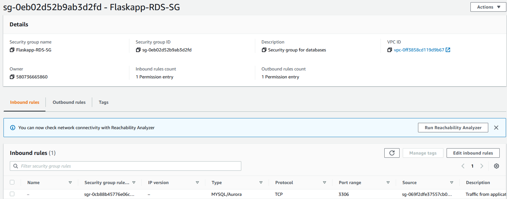

# Flask app in AWS Architecture

## __Description:__

* Use a Flask app created as a sample (_Coffee Radar App_) to create an AWS solution

* The main idea is for the site to have a high availability and fault tolerant environment in which their business can rely on. 

* Users need to be able to register, shop and check their orders (among other things). For this purpose, a secure database needs to be provided.

## __Implemented Solution:__

  

* <ins>Region:
    - US East - N. Virginia

* <ins>Availability zones:
    - us-east-1a
    - us-east-1b

* <ins>VPC:
    - 2 public subnets (one in each AZ)
        - 10.0.1.0/24 (us-east-1a)
        - 10.0.2.0/24 (us-east-1b)
    - 2 private subnets (one in eachAZ)
        - 10.0.64.0/19 (us-east-1a)
        - 10.0.32.0/19 (us-east-1b)
    - Internet gateway (internet-facing, associated with the VPC and linked to the __public subnets'__ route tables)
    - Elastic Load Balancer (applications ELB , internet-facing,  associated with the VPC and linked to the __private subnets'__ route tables)
    - VPC endpoint (linked to private subnets. Allows S3 access without going out through the public internet) 

* <ins>Resources in public subnets:
    - NAT gateways (linked to the __private subnets'__ route tables)
        
* <ins>Resources in private subnets:
    - Auto Scaling Group:
        - Target groups: EC2 - Web servers  
    - RDS:
        - Master RDS in private subnet of one AZ (us-east-1a)
        - Standby RDS in private subnet of the other AZ (us-east-1b)

* <ins>Regional resources:
    - S3 bucket 

## __How does it work?__:

Once users access the app, the load balancer distributes the load between the different servers that are running inside the auto scaling group, to be able to respond to each and every petititon in an efficient way.

The auto scaling group creates (or deletes) new web servers according to the amount of requests (or memory usage), and the status received from the running servers' healthchecks.

Each newly created server is built from a launch configuration, which takes a pre-created AMI as a base. The AMI contains all the necessary resources to run the app: 
 

 * _Flask -> Gunicorn -> Nginx_

  

  

Since the app is created over two AZs, it becomes a highly available environment: if a server in one of the zones fails, the load balancer will redirect the petitions to a server in the other AZ.

Both HTTP and HTTPS requests are received by the load balancer, and are redirected to the servers that host the app.

_Load Balancer Security group:_

 

_Servers' Security group:_

 * They receive the requests coming from the ELB

 

The RDS MySQL database stores users' interaction inside the app.

It receives and stores personal data (such as hashed passwords, name, address, filename of their profile pictures, etc.), and also their purchase orders history.

_Database Security group:_

 * Receives the requests coming from the web servers

_Database tables:_

* Users table:

* Orders table:

Inside the S3 bucket, static components of the app an users' profile pictures are stored.

Using boto3 connection, the app retrieves and shows the necessary resources.

## __Improvements to the current solution:__ 

<ins>Route 53:
* Register the apps DNS and connect the service to the load balancer.

<ins>IAM Roles:
* Create new roles to allow EC2 instances to connect to both S3 and the RDS.

<ins>QuickSight: 
* Create reports that may bring insights about sales and users' interactions with the app.

<ins>Cloudfront:
* Lower latency responde, speed up distribution of the static and dynamic web content, such as .html, .css, .js, and image files, to the users. 

<ins>AWS WAF: 
* Implement a firewall to protect the app and make it more secure.

<ins>Best practice: 
* RDS in a private subnet, app servers in another private subnet.

## __App demo video:__ 

